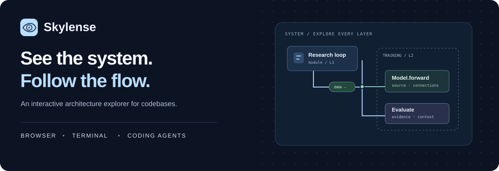
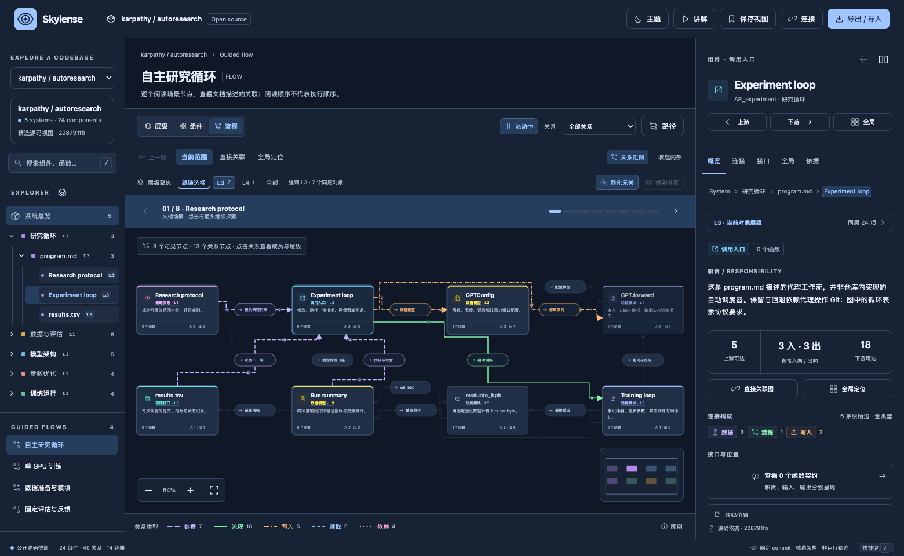
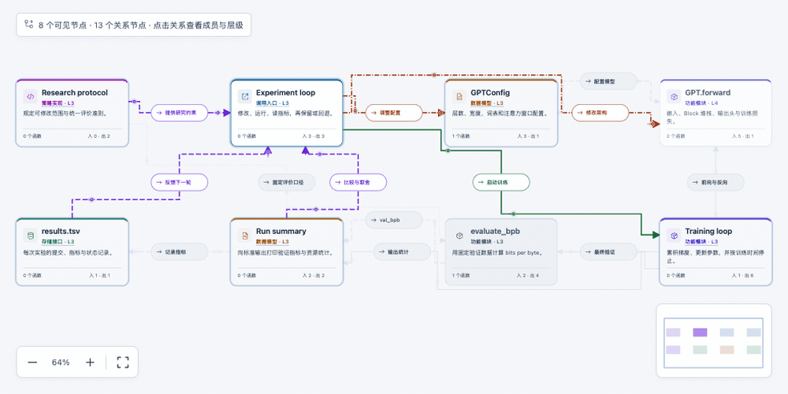
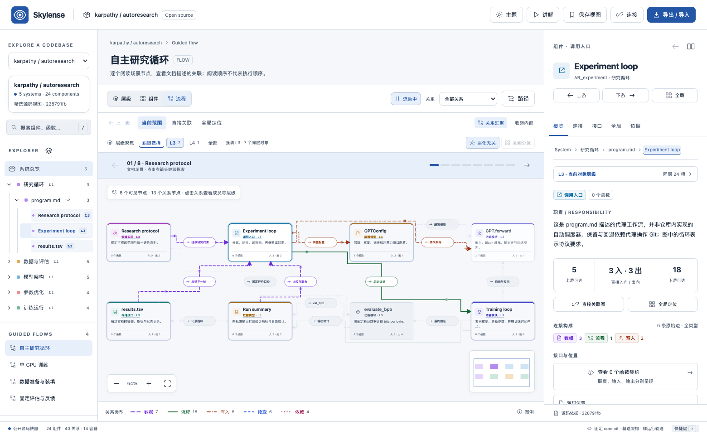
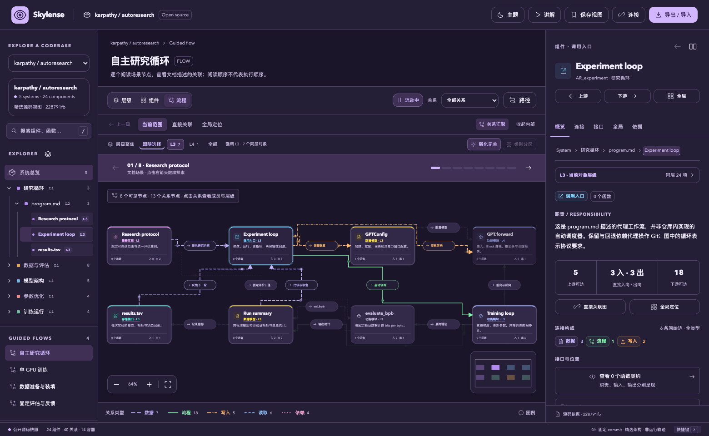

<div align="center">



**An interactive architecture explorer for codebases.**

Explore the hierarchy. Follow a connection. Open the source behind it.<br>
One connected map for your browser, terminal, and coding agent.

### [Open Skylense ↗](https://danielchen26.github.io/skylense-app/app/?open=source) &nbsp; · &nbsp; [Download offline ↓](https://github.com/danielchen26/skylense-app/releases/download/v0.3.1/skylense-0.3.1-web-preview.zip)

**No account · Offline-ready · Six themes · Source-linked**

[Website](https://danielchen26.github.io/skylense-app/) · [Terminal & MCP](#terminal--mcp) · [中文](README.zh-CN.md) · [Release notes](https://github.com/danielchen26/skylense-app/releases/tag/v0.3.1)

</div>



## From a codebase to a clearer picture

| Your question | Your next move |
| --- | --- |
| **Where does this fit?** | Expand from systems to modules and components. Keep parent and global context in view. |
| **What connects these points?** | Build a route with chosen intermediate stops, inspect each relationship, and compare bounded alternatives. |
| **What happens along this flow?** | Walk through curated scenarios with animated direction cues and connected details. |
| **Where is the evidence?** | Open source excerpts, commit-pinned links, inputs, outputs, and individual edge details. |
| **How can I explain it?** | Save your reading position or use presentation mode to guide someone through the map. |



*Actual app recording. Animation shows direction in the source map; it is not live execution or measured traffic.*

## Download. Unzip. Explore.

1. **[Download the Web app](https://github.com/danielchen26/skylense-app/releases/download/v0.3.1/skylense-0.3.1-web-preview.zip).**
2. Extract the `skylense-web` folder.
3. Open **`standalone.html`** in a modern desktop browser.

No Node.js installation, API key, account, or build step is needed for the Web app. Prefer to try it first? **[Open the live app](https://danielchen26.github.io/skylense-app/app/)**.

> **0.3 public preview.** Open your own folder, selected files, public GitHub URL or webpage. The static analyzer creates a bounded source map with a coverage report; Python/JS/TS imports, document headings and links get additional structure. Other files keep hierarchy and previews or metadata. The interface is primarily Chinese. [Supported sources and limits](guides/SOURCES.md).

## Bring your own source

In the Web app, choose **打开来源 / Open source**. Select a folder or files, enter a public URL, or paste text/HTML. Review the coverage report, then enter the same full workbench.

With the Agent toolkit installed:

```sh
skylense open /path/to/project
skylense open https://github.com/owner/repo
skylense open https://example.com
skylense analyze /path/to/project --output architecture.json
```

The toolkit includes the complete Web app. Local `open` handles public webpages that block direct browser CORS; it never executes source code or website scripts. Existing Skylense JSON opens with its authored contracts, scenarios and source evidence intact. [Source guide](guides/SOURCES.md) · [Agent model authoring](guides/MODEL.md).

## Start with a real AI codebase

| Map | What you can explore |
| --- | --- |
| **[autoresearch →](https://danielchen26.github.io/skylense-app/app/?example=autoresearch)** | Research iterations, GPT training, optimization, and evaluation. |
| **[LangGraph →](https://danielchen26.github.io/skylense-app/app/?example=langgraph)** | Graph compilation, Pregel execution, state channels, and checkpoints. |
| **[vLLM →](https://danielchen26.github.io/skylense-app/app/?example=vllm)** | Requests, inference scheduling, KV cache, and GPU execution. |

These are selected core paths through fixed source revisions, with authored reading groups and attributed excerpts. [Source and license notices](EXAMPLE_NOTICES.md).

## Six themes. Keep your perspective.

**Porcelain · Jade · Sandstone · Midnight · Graphite · Aurora**

Switch with **T** while preserving your selection, reading position, and zoom. Surfaces, typography, and geometry change together; component identities and relationship meanings stay intact.

<p align="center">
 
</p>

[**Try all six theme previews →**](https://danielchen26.github.io/skylense-app/#themes)

## Terminal & MCP

Use the same model in an interactive terminal, through JSON output, or from a compatible coding agent.

Download the **[Agent & Terminal toolkit](https://github.com/danielchen26/skylense-app/releases/download/v0.3.1/skylense-0.3.1.tgz)**. With **Node.js 22+**, install the downloaded file:

```sh
npm install -g /absolute/path/to/skylense-0.3.1.tgz
skylense tui autoresearch
```

Arrow keys navigate; **Enter** expands; **Tab** switches panels; **u / d** follows upstream or downstream relations; **/** searches.

```sh
# Ask a focused question
skylense search autoresearch optimizer --json

# Follow the original directed relationships
skylense trace autoresearch AR_train --depth 2 --json

# Print local MCP connection settings
skylense config
```

Eight MCP tools let an agent **analyze sources, export models, list, search, inspect, traverse, read scenarios, and open visual views**. Use `skylense config --root /path/to/project` to explicitly grant local source access. Custom/analyzed models open in the complete local workbench. Copy the generated configuration into a client supporting **local stdio MCP**. Each client has its own configuration location.

[**Agent setup and local Web links →**](guides/AGENTS.md) · [**Terminal controls →**](guides/TERMINAL.md)

## Pick the right download

| Download | Includes | Requires |
| --- | --- | --- |
| **[Web ZIP](https://github.com/danielchen26/skylense-app/releases/download/v0.3.1/skylense-0.3.1-web-preview.zip)** | Interactive explorer, six themes, all three maps, offline HTML | Modern desktop browser |
| **[Agent toolkit](https://github.com/danielchen26/skylense-app/releases/download/v0.3.1/skylense-0.3.1.tgz)** | Source analyzer, full local Web app, CLI, terminal and MCP server | Node.js 22+ |
| **[Checksums](https://github.com/danielchen26/skylense-app/releases/download/v0.3.1/SHA256SUMS.txt)** | SHA-256 for both files | Optional integrity check |

Choose the named ZIP or TGZ above, rather than GitHub's automatically generated source archives. A native macOS installer is not included yet.

## Local by design. Explicit when connected.

The Web app runs offline. Imported JSON stays in the current page session. The CLI reads selected folders/files or public URLs. MCP local source access is confined to an explicitly configured root. Neither executes the displayed repositories or page scripts.

A connected agent receives query results and may send them to its configured model provider. Browser imports do not automatically sync to that process. [Data boundaries](PRIVACY.md).

## Help shape the next view

[Report a confusing connection or a bug](https://github.com/danielchen26/skylense-app/issues/new?template=bug_report.yml). Include the example, selected object, and steps to reproduce. Share a public-example screenshot with a teammate who is learning the same codebase.

> **Share Skylense:** An interactive code architecture explorer. Follow layers and connections, inspect the source, and use the same map in your browser, terminal, and coding agent.

**Preview distribution.** You may download and run the provided unmodified application preview. Skylense is not offered under an open-source license; source licensing and commercial rights remain reserved. Upstream example materials retain their own licenses. [Preview notice](NOTICE.md).

---

<p align="center"><b>Skylense</b> · See every layer. Follow every connection.</p>
